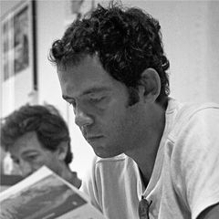
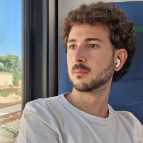

# **HACK MORE – HACKathon on MOdeling & REndering**

The Italian Chapter of **EUROGRAPHICS**, the European Association for Computer Graphics, is proud to announce **HackMore 2025**, the Hackathon on Computer Graphics!

Participants are invited to put their **3D modelling** and **3D rendering** skills to the test, combining technical ability and creativity.

A team is composed of:

- **1 Modeller (M)** — produces an interesting 3D shape  
- **1 Renderer (P)** — produces an image or video of that shape  

The most compelling final imagery wins.

---

# **General Information**

**Date & Time:**  
**November 15, 2026**, from **8:30 AM to 7:00 PM**

**Location:**  
November 15, 2026
CAMPUS ITS Steve Jobs Academy, 
via Madden 153  Catania

**Duration:**  
Full‑day event (10 hours)

**Participation:**  
Open to all upon **FREE registration**

---

# **Prizes and Awards**

- Winning team: **500 €**  
- Solo participation: **250 €**  
- Official award from the Italian Chapter of Eurographics

---

# **Participation & Teams**

This is a **team competition**.

Each team consists of:

- **2 people**:  
  - **1 Modeler (M)**  
  - **1 Renderer/Programmer (P)**  

If necessary, a team may consist of **only the programmer** (a model will be provided by the organizers).

You may:

- Register as a **pre‑formed team**
- Register **individually** and form a team on site before activities begin

---

# **Registration**

- Registration is **mandatory**
- Possible as a team or individually
- **Limited spots** — early registration recommended
- **Hostel accommodation** provided to early registrants who need it due to travel distance

---

# **Requirements**

Designed for university students who have attended a computer graphics or 3D modeling course, but **open to everyone** (pre‑university, postgraduate, PhD, etc.).

Participants must bring their **own laptop**.

For Programmers:

- Install preferred development tools **in advance**

---

# **The Challenge: 3D Modeling & Rendering**

Teams must produce a **short video** showcasing a 3D model, on a **theme revealed on the day**.

The model must follow a **specific modeling approach**, also revealed on the day  
(hint: *it’s not a common one*).

The final video is a **free‑choice animation** (camera, lighting, procedural, etc.) whose purpose is to showcase the model.

### **Specifications**

- **Aspect ratio:** 1:1  
- **Duration:** 0–10 seconds  
- **Resolution, frame rate, color depth:** free choice  

---

# **Evaluation**

Teams must submit:

- The **final video**
- The **3D model file** (format specified at event)
- The **full source code** of the rendering program

### **Criteria**

- Wow factor  
- Adherence to theme  
- Creativity & artistic originality  
- Technical & artistic quality of modeling  
- Visual, technical, and artistic quality of the video  
- Technical features (resolution, duration, frame rate)

---

# **Day Timetable**

| Time | Activity |
|------|----------|
| **08:30 – 09:00** | Registration & Team Formation |
| **09:00 – 11:00** | Introductory Tutorials & Challenge Briefing |
| **11:00 – 19:00** | Project Development |
| **19:00** | Submission via GitHub commit |

---

# **Other Important Information**

- Use of copyrighted content is forbidden unless declared open‑source  
- All team members must actively contribute  
- Participants must behave respectfully and collaboratively  
- Organizers may exclude participants for rule violations  
- Participants are responsible for their own hardware/software  
- Bring power cables, power strips, backup devices  
- Wi‑Fi available, but a backup connection is recommended

---

# **Contacts**

For information:  
**fabio.ganovelli@isti.cnr.it**

    

        
        
N. Capece

        
<a href="mailto:n.capece@email.com" style="color: #0366d6; text-decoration: none;">n.capece@email.com</a>

    

    

        
        
F. Ganovelli

        
<a href="mailto:f.ganovelli@email.com" style="color: #0366d6; text-decoration: none;">f.ganovelli@email.com</a>

    

    

        
        
K. Lupinetti

        
<a href="mailto:k.lupinetti@email.com" style="color: #0366d6; text-decoration: none;">k.lupinetti@email.com</a>

    

    

        
        
F. Ponchio

        
<a href="mailto:f.ponchio@email.com" style="color: #0366d6; text-decoration: none;">f.ponchio@email.com</a>

    

    

        
        
R. Rizza

        
<a href="mailto:r.rizza@email.com" style="color: #0366d6; text-decoration: none;">r.rizza@email.com</a>

    

    

        
        
M. Tarini

        
<a href="mailto:m.tarini@email.com" style="color: #0366d6; text-decoration: none;">m.tarini@email.com</a>

    

